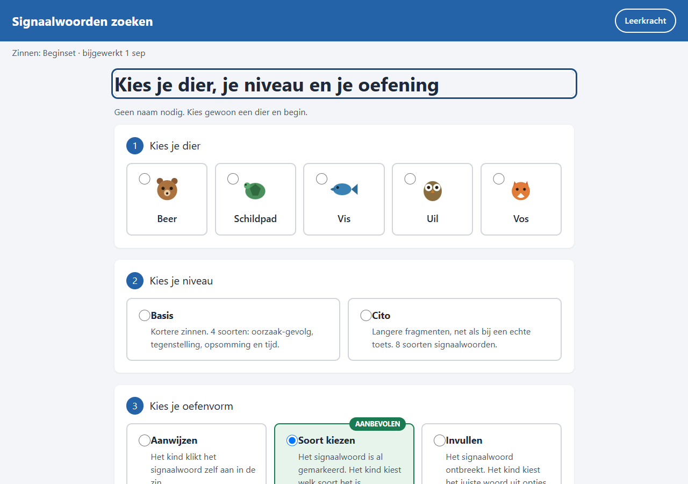
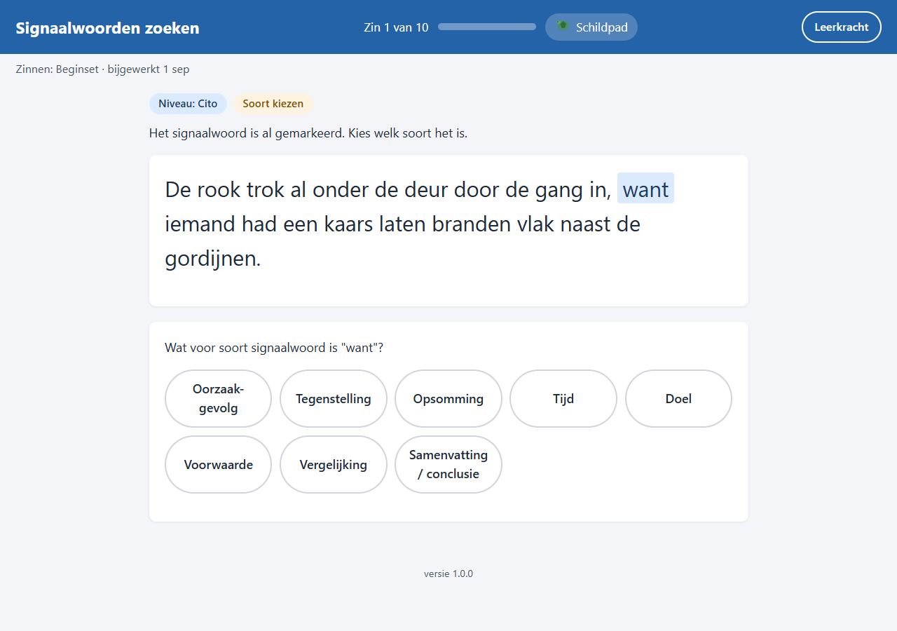
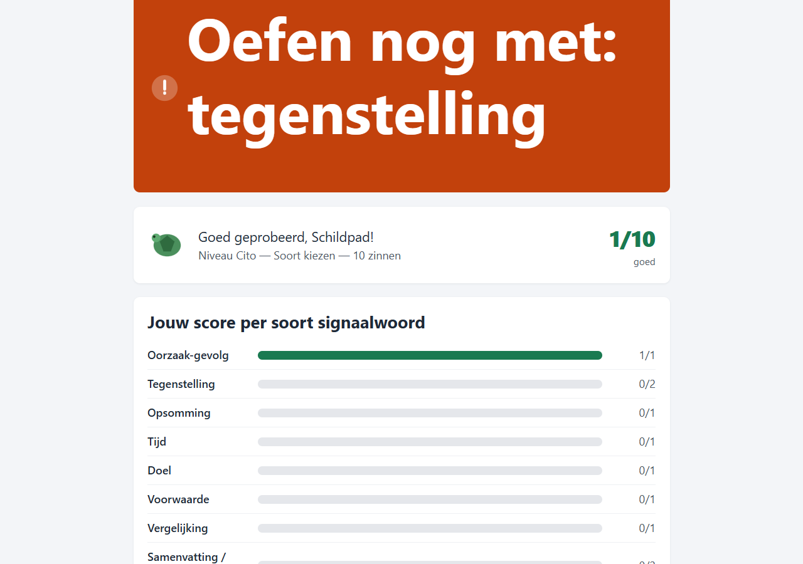
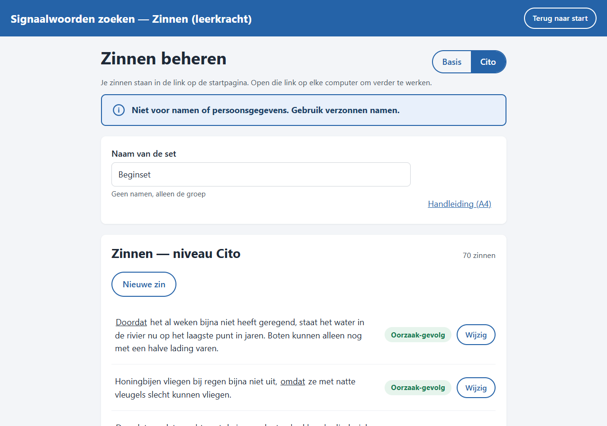

# Signaalwoorden zoeken

Een webapp waarmee kinderen in groep 6-8 zelfstandig oefenen met signaalwoorden, in
langere, Cito-achtige zinnen. Geen namen, geen inloggen, niets wordt bewaard of verstuurd.






## Voor kinderen

1. Kies een dier (alleen voor de leuk, geen naam nodig).
2. Kies een niveau: **Basis** (4 soorten signaalwoorden, kortere zinnen) of **Cito** (8
   soorten, langere fragmenten).
3. Kies een oefenvorm: **Aanwijzen**, **Soort kiezen** of **Invullen**.
4. Beantwoord 10 zinnen. Na elk antwoord zie je meteen of het goed is, met een korte uitleg.
5. Aan het eind zie je je score per soort signaalwoord, met bovenaan het soort waar je nog
   mee kan oefenen. Klik op "Nieuwe ronde" om opnieuw te beginnen.

## Voor de leerkracht

De zinnen staan in de link die op de startpagina van de school staat (de "klaslink"). Er is
geen inlog en geen apart bestand nodig.

1. Open de klaslink en klik rechtsboven op "Leerkracht".
2. Klik een bestaande zin aan om die te wijzigen, of klik op "Nieuwe zin".
3. Klik het signaalwoord in de zin aan om het te markeren, en kies het soort en het niveau.
4. Klik op "Link bijwerken" en daarna op "Kopieer nieuwe link".
5. Vervang de oude link op de startpagina door de nieuwe.

Zolang je een wijziging nog niet hebt gekopieerd, blijft de oranje melding "Vervang de
link op de startpagina" staan, en vraagt de browser bij het sluiten van het tabblad of je
zeker weet dat je wilt stoppen. Elke leerkracht heeft haar eigen link; de links staan los
van elkaar. Zie ook de [handleiding](app/handleiding.html) (print naar één A4'tje).

## Privacy

- Het gekozen dier en de score van een ronde staan alleen in het geheugen van het
  browsertabblad, en zijn weg na "Nieuwe ronde", een nieuw dier, herladen of het sluiten
  van het tabblad.
- De werkkopie van de leerkracht staat alleen in `sessionStorage` van dat ene tabblad
  (nooit `localStorage`), en is weg zodra het tabblad dicht gaat.
- De zinnen van de leerkracht staan in de link zelf, na het `#`-teken. Dat deel van de
  link gaat nooit naar een server.
- Er wordt niets over kinderen opgeslagen of verstuurd.

Zie [DISCLAIMER.md](DISCLAIMER.md) voor de volledige voorwaarden.

## Zelf draaien

```powershell
npm install
npm run serve
npm test
```

Open daarna `http://localhost:4173/tools/signaalwoorden-zoeken/app/` in de browser.

## Zelf neerzetten

Kopieer de map `app/` ongewijzigd naar een eigen HTTPS-webserver, in een map naar keuze.
Er is geen database en geen servercode nodig. Zorg dat de server `.webmanifest` als
`application/manifest+json` serveert en `.js`-bestanden als JavaScript. Zie
[HULP.md](HULP.md) voor meer details.

## Broncode

https://github.com/ossehaas/signaalwoorden-zoeken

## Meer lezen

- [HULP.md](HULP.md) — wat te doen als het niet werkt, en hoe ICT de app zelf kan hosten.
- [AANPASSEN-MET-AI.md](AANPASSEN-MET-AI.md) — de app zelf aanpassen met een AI-assistent.
- [DISCLAIMER.md](DISCLAIMER.md) — voorwaarden voor gebruik.
- [LICENSE](LICENSE) — MIT-licentie.
